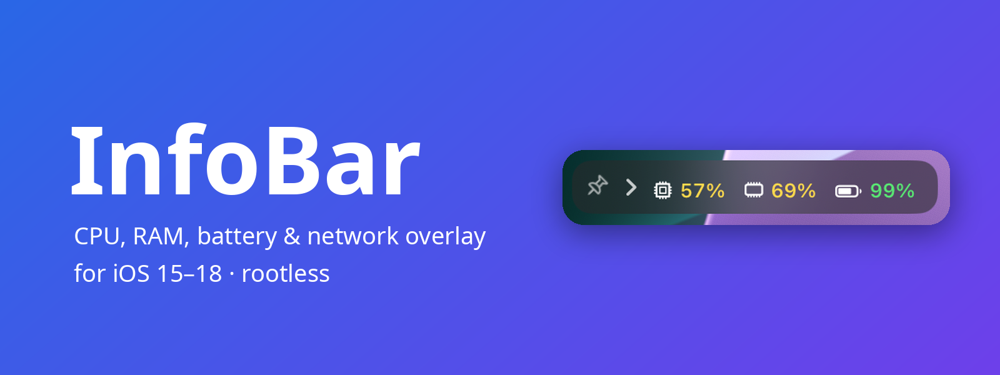
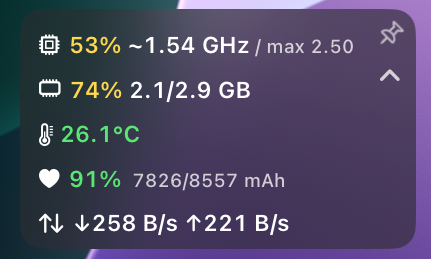
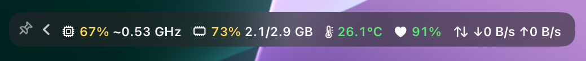

<p align="center">
  
</p>

A movable system overlay for iOS 15–18 (rootless jailbreaks such as Dopamine).
It shows CPU, RAM, battery, network and system info on top of every app and can
be fully configured in the Settings app (PreferenceLoader).

## Screenshots

<details>
<summary>Screenshots</summary>





</details>

## Features

| Section  | Values |
|----------|--------|
| CPU      | Usage in %, clock in GHz (P and E cores separately in list view, incl. max clock), chip & core count |
| RAM      | Usage in %, used/total in GB |
| Battery  | Charge level, temperature (°C/°F), power in W (+ charging / − discharging) and mA, voltage, charger wattage, battery health in %, charge cycles |
| Network  | Download/upload speed (Wi-Fi + cellular), Wi-Fi IP |
| System   | Time, free storage, uptime, thermal state |

**Usage**

- **Drag** the bar to move it; the position is saved.
- Tap the **pin** to lock the bar in place so it can't be moved. Tap again to unlock.
- Tap the **arrow** next to the pin to collapse/expand the bar. When collapsed it
  shows only CPU, RAM and battery in % – or just the buttons, if you prefer.
- **Double tap** switches between *Row* (everything side by side) and *List* (one value per line, more detail).
- Touches next to the bar go straight to the app underneath.

**Settings** (Settings → InfoBar), all applied instantly without a respring:
enable, pin, show pin/collapse button, collapsed state and content, lock screen,
hide in landscape, layout, update interval (0.5–5 s), icons or text labels,
color-coded values (green/yellow/red), blur, text color, font size, opacity,
corner radius, every module individually, reset position and reset all.

Nothing is measured while the screen is off, so the tweak doesn't drain your battery.

## Installation

1. Download the latest `com.mathelord.infobar_*_iphoneos-arm64.deb` from the
   [**Releases**](../../releases) page.
2. Install it with Sileo, Zebra or Filza (or `dpkg -i <file>.deb` over SSH).
3. Respring.

Dependencies (`mobilesubstrate`, provided by ElleKit on Dopamine, and `preferenceloader`)
are installed automatically by your package manager.

Development builds are available as the **InfoBar-rootless** artifact of each
*Build* run under **Actions** (requires a GitHub login; unzip it to get the `.deb`).

## Building

Requires [Theos](https://theos.dev) with the patched `iPhoneOS16.5.sdk` from
[theos/sdks](https://github.com/theos/sdks) in `$THEOS/sdks`.

```sh
make package FINALPACKAGE=1                                  # rootless (default)
make package FINALPACKAGE=1 THEOS_PACKAGE_SCHEME=roothide    # with roothide Theos
```

arm64e devices (A12 and newer) need a build with Xcode or another recent toolchain
(new arm64e ABI) – that's exactly what the GitHub Actions workflow does.

## Technical notes

- Runs inside SpringBoard as its own window (level above the status bar and banners).
- CPU clock: residency of the performance states via the private IOReport API,
  combined with the DVFS table from the device tree (`pmgr`). If that isn't
  available on a device, the clock is estimated with a short timing loop
  (shown with a `~`).
- Battery values come from the IOKit service `AppleSmartBattery`.
- "Used" RAM is calculated like Activity Monitor on macOS
  (app memory + wired + compressed).

## License

[PolyForm Noncommercial 1.0.0](LICENSE) – free to use, modify and share for
non-commercial purposes; selling it or using it commercially is not allowed.
